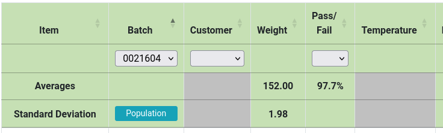

<!-- markdownlint-disable MD033 MD041 -->
<div align="center">

# AnalyticalHeaders for Datatables


</div>

This extension is for [DataTables](https://datatables.net/)



## General

Add up to three additional headers to your datatable

1. Dropdown filter
2. Averages
3. Standard Deviation (population and sample)

It can be used in conjunction with
[FixedColumns](https://github.com/DataTables/FixedColumns) and
[FixedHeaders](https://github.com/DataTables/FixedHeader), if imported
before them.

### Caveats

1. Currently, the population/sample button will always show in the 1st column
2. Currently, this is only for tables *without* server side processing.
   *(Aka, all the data is loaded at the beginning)*
3. I've only tested it with the Browser.

## Install

### NPM

```bash
npm install https://github.com/Nealium/analyticalheaders-dt
```

### Standalone

Copy the contents of `js/dataTables.analyticalHeaders.js` into your project.

> What I have done is `npm` installed it and *then* placed the file into my
> project. This way there's still LSP support.

## Usage

```javascript
$("#DataTable").DataTable({
    // .. Regular settings
    analyticalHeaders: {
        // required. Set to `false` to disable
        filter: {
            // do not generate filter for column 0 (PRIMARYKEY)
            ignore: [0],
            // set `multiple="true"` for column 1
            multi: [1]
            // encoded columns and their decoder
            encoded: {
                1: (raw) => {
                    // `${url}__${display_value}`
                    raw.split("__");
                    return (raw[1] ? raw[1] : null)
                }
                2: (raw) => {
                    // `${url_with_primary_key}__${category}`
                    raw.split("__");
                    return (raw[1] ? raw[1] : null)
                }
            },
            // manually check uniqueness of column 2's items
            encoded_check: [2];
        },
        stats: {
            // generate the average header
            average: true,
            // generate the standard deviation header
            standard_deviation: true,
            // columns to calculate
            targets: [3, 4, 5, 6],
            // encoded columns and their decoder
            encoded: {
                3: (raw) => {
                    // `${background_color}__${value}`
                    raw.split("__");
                    return (raw[1] ? raw[1] : null)
                }
            }
            // `boolean` columns and their decider
            boolean: {
                12: (raw) => raw == "Pass"
            },
            // background color for cells without a calculation
            empty_background_color: "silver",
        },
    },
});
```

## Contributing

Go for it! I just ask to use a [EditorConfig](https://editorconfig.org/)
plugin, [eslint](https://eslint.org/), [prettier](https://prettier.io/)
and to make it compatible with a Typescript LSP!

## Sources

1. [DataTables](https://github.com/DataTables/DataTables) itself, for
   the trimmed down `_fnDetectHeader`
2. [FixedColumns](https://github.com/DataTables/FixedColumns), for
   general plugin structure and their `factory`
